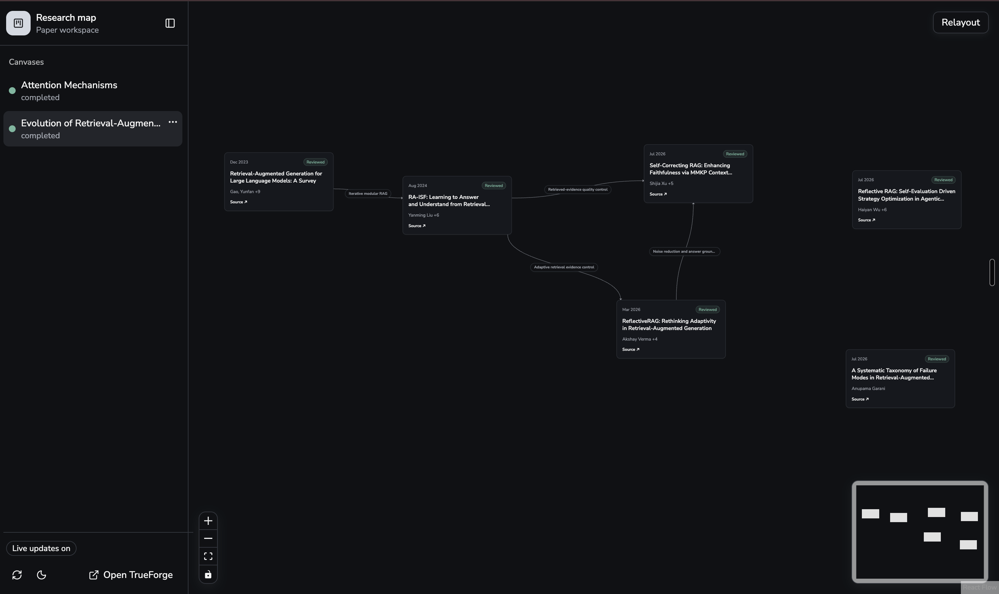
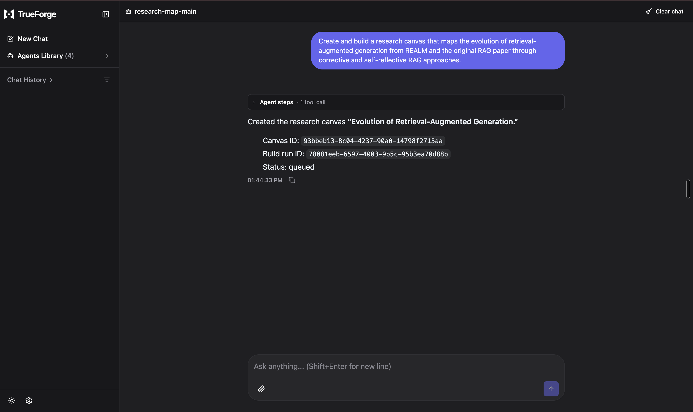

# Scholarly

Exploring and reading research made accessible with Scholarly!
Powered by [TrueForge](https://github.com/truefoundry/trueforge) and
[Bright Data](https://brightdata.com/).



## Getting Started

You will need the following API Keys:

```bash
    BRIGHTDATA_API_KEY=
    OPENAI_API_KEY=
```

Copy [`backend/.env.example`](backend/.env.example) to `backend/.env`, then set
both values in `backend/.env`. You can also set them in a `.env` file at the
repository root.

## Spinning up servers

There are two servers. The backend uses local SQLite at
`.data/research_map.sqlite3` and the startup flow creates and migrates it
automatically. Use the following commands to run the servers:

```bash
    # Installing dependencies
    uv sync --directory backend
    pnpm --dir ui install --frozen-lockfile

    ./scripts/dev.sh
```

This will spin up the following services for you:

-  Canvas UI: http://127.0.0.1:5173
-  FastAPI: http://127.0.0.1:8000
-  TrueForge: http://localhost:8790

Now you can navigate to `http://localhost:8790` and open `http://127.0.0.1:5173` for Canvas UI!


## Adding connectors

Now navigate to `http://localhost:8790` and add the following connectors:
 - BrightData
 - OpenAI
 - research-map (Our UI!)


The startup script automatically registers this MCP server in TrueForge:

  Name: research-map
  Type: Remote
  URL: http://127.0.0.1:8000/mcp
  Authentication: None

It also creates or updates the four saved agents!

- Main Agent: Control and orhcestrate canvas creation 
- Discovery Agent: Find papers for your canvas that align with your queries
- Review Agent: Reviews the papers to give you a simple undestanding of the core ideas
- Relation Agent: Adds relationships between the reviewed papers to connect related ideas

If automatic registration did not work:

  1. Open http://localhost:8790.
  2. Go to Settings → Connectors.
  3. Select Add MCP Server.
  4. Enter:

  Name: research-map
  URL: http://127.0.0.1:8000/mcp
  Description: Research map application tools
  Authentication: No auth

  5. Save the connector.
  6. Edit the research-map-main agent.
  7. Attach the research-map MCP server.
  8. Enable:

  get_canvas
  create_canvas_and_start_build
  

## Example Research Map




